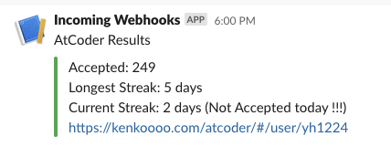

# NotifyAtCoder

AWS Lambda で定期的に AtCoder の非公式 API から現在のステータスを取得し、累計の回答数や連続回答日数を通知します。

### Deploy

以下からデプロイできます。

- [NotifyAtCoder - AWS Serverless Application Repository](https://serverlessrepo.aws.amazon.com/applications/arn:aws:serverlessrepo:ap-northeast-1:215154909368:applications~NotifyAtCoder)

必要なパラメータを入力し、「このアプリがカスタム IAM ロールを作成することを承認します。」をチェックして「デプロイ」ボタンを押してください。

### Parameters

|Name|Description|
|:--|:--|
|AtCoderUsername|AtCoder のユーザー名 (必須)|
|SlackWebhookUrl|通知先の Slack Webhook URL (省略した場合、通知しません)|

内部的に SNS トピックを生成しているので、生成されたトピックを Subscribe することで、メールや SMS を送信したり他の Lambda を呼び出したりすることもできます。

### Special Thanks

- [AtCoder](https://atcoder.jp/)
- [AtCoder Problems](https://kenkoooo.com/atcoder/#/table/)
